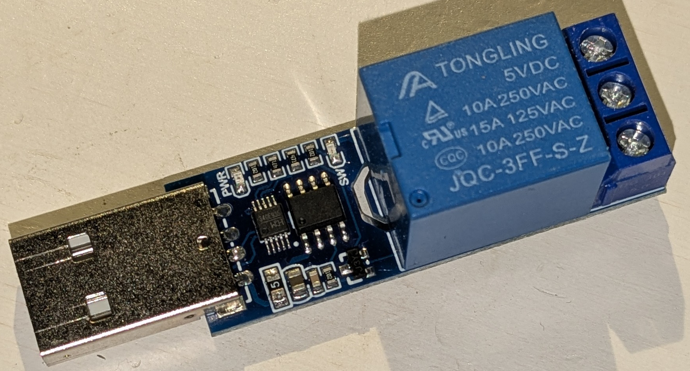
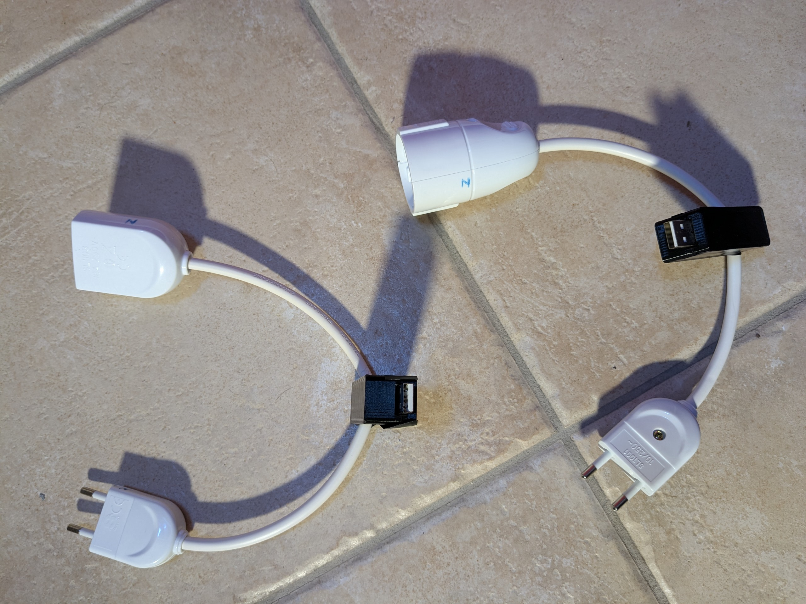
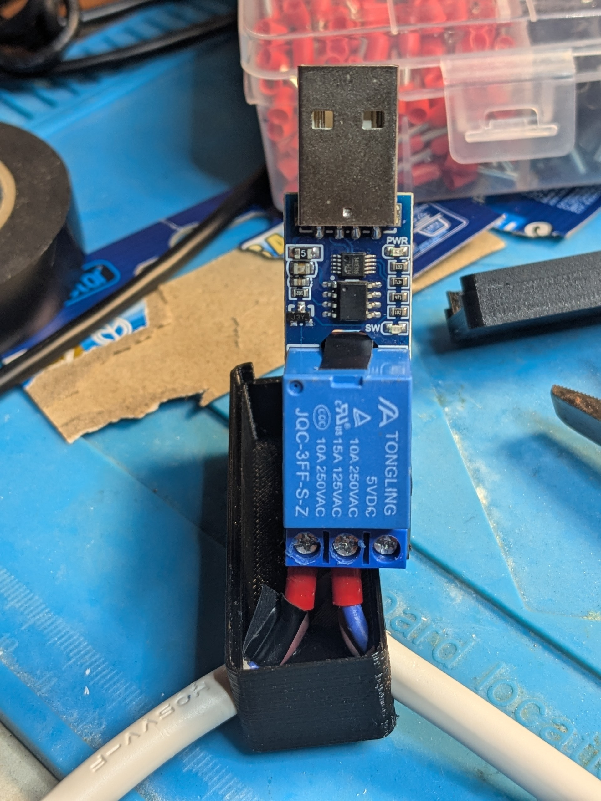

# batguard

batguard is a laptop battery-charge-manager systemd-service-unit designed to extend the laptop battery lifespan.

batguard is conceived, designed and written by Simone Pernice. Develop begun on 2024/12/26, first working version 1.2 released on 2025/02/23

batguard Copyright (C) 2025 Simone Pernice pernice@libero.it 

batguard is free software: you can redistribute it and/or modify
it under the terms of the GNU General Public License as published by
the Free Software Foundation, either version 3 of the License, or
(at your option) any later version.
 
batguard is distributed in the hope that it will be useful,
but WITHOUT ANY WARRANTY; without even the implied warranty of
MERCHANTABILITY or FITNESS FOR A PARTICULAR PURPOSE.  See the
GNU General Public License for more details.
 
You should have received a copy of the GNU General Public License
along with this program.  If not, see <http://www.gnu.org/licenses/>.

## Introduction

 The longest battery lifespan is reached if it is kept at 50% of its capacity. The closer the battery charge level to full charge or full discharge, the shorter is its lifespan. Therefore, a laptop computer usually linked to the power network keeping its battery close to 100% for most of the time shortening its life. However, there are case when higher capacity is required, for instance before a trip where there will not be any power outlet to recharge. 
 
 That problem is well known, there are some brands of laptop, where it is possible to set the battery charge level. However, that is not the case on most of the available brands on the market, while for some with that capability, there is not any support under Linux. batguard is a Linux Systemd service to keep the laptop battery charge within the user selected range. batguard is laptop brand agnostic. batguard allows to change the charge range by user command, for instance to prepare for an unplanned trip, or on a repetitive schedule for periodic travels. batguard requires an external USB controlled relay, it is a cheap device called LCUS. The version with a single relay is available on AliExpress.com for about 3€. It has to be linked between the power network and the laptop charger. batguard controls the charger by means of that external relay.

batguard applies one among the user defined charge profiles. Each charge profile has a name and the charge level range in which the battery should be kept. The user can select a profile by name to change the charge range. 

batguard can use profile schedules. Each schedule has the periodic time setting and the profile to use. That allows for periodic profile change based on time.

batguard uses a command file, where the user can write to force the profile, the charger status and if the scheduler is enabled.  

batguard uses three files:

* /etc/batguard/config: configuration file is read just once at boot, it contains the configurations required to make the service working. A change in the configuration file will be loaded at the next boot. To re-load immediately the configuration, it is possible to restart the service with the command sudo systemctl restart batguard 
* /etc/batguard/command: command file is read and cleaned at every polling, the user can write it to force a profile change, enable and disable the charger and/or scheduler.
* /etc/batguard/state: state file, is updated with the current state (charge profile, charger state, scheduler state), it is used at start-up to continue from the last state

## USB Relay

There are several variants of USB Relay called LCUS with 1, 2, 4 or even 8 channels. batguard can manage any version as far as the correct channel is selected in the configuration file. 

The next picture shows the cheaper variant with a single relay:

It has to be linked between power and the charger as visible on the next pictures:

 
 

To be safer, all the relay pins at network voltage can be covered by several layers of electrical tape. The relay may be closed on a 3D case whose STL model is provided. The neutral line may be interrupted for the maximum safety, so that in case of leakage, the line does not go in contact to computer USB. Unfortunately, in some country as mine (Italy), it is possible to insert the plug in both directions on the wall socket, so the correct insertion orientation has to be find with a line-detector and written on the plug with a pencil. By default the NO (normally open) pins of the relay should be used so that when the computer is turned off the charge is interrupted. Never the less, batguard can manage also the link to NC  as long as the computer is running, at power off the charger will restart. 

!!!DANGER!!! read carefully the following advises: 

* Take care of the electrical links required to assembly the relay to the power cord, being high voltage there is electric shock risk!!! 
* Verify with a high range Ohm meter there is open circuit at the largest scale between power lines and USB signals to avoid any computer damage!!!
 
## Profiles

At any time, batguard ensures the battery charge is in the range defined by the current profile. The user can define many profiles but only one is active at any time.

Each profile contains the following data:

* name: the name of the profile to be referred later in the settings
* minimum allowed capacity threshold
* maximum allowed capacity threshold
* initial state: on/off is the charger state used when the profile is changed if the battery charge falls between the thresholds 

The charge is expressed in percentage of the full charge. If the battery charge is lower than the minimum, batguard enables the relay to run the charger. If the battery charge is higher than the maximum, batguard disables the charger waiting for the laptop to discharge it. If the battery charge is between the thresholds, the last charger state is kept. 

At least one profile must be defined to allow batguard to run. It is not allowed to define profiles with same name neither with same thresholds even if with different names. Profile name allowed characters are numbers, letters, and under scores. 

## Scheduling profiles

batguard can automatically switch among profiles based on schedules. The schedule are defined by an interval of time and a profile to be used during that period. 

The schedule trigger time is defined as follows:

* Enabled:          on/off
* Month Of Year:    at which month of the years 1 (January) to 12 (December) the schedule applies 
* Day Of Month:     at which day of month 1 to 31 the schedule applies  
* Day Of Week:      at which day of week 1 (Sunday) to 7 (Sunday) the schedule applies
* From time:        at which hour (0 to 23) and minute (0 to 59) the schedule begins
* To time:          at which hour (0 to 23) and minute (0 to 59)  the schedule ends
* Profile:          the profile name to be used if the schedule is active

A schedule is active if all the following conditions are satisfied: 

* it is enabled (on)
* the months of the year matches with the current local month
* the days of the month matches with the current local day
* the days of the week matches with the current local day
* from time is smaller or equal than the local time 
* to time is greater or equal than the local time  

For the first three fields, it is possible to provide a list with single days and/or intervals:

* 5 selects the day 5
* 1-6 selects the days 1, 2, 3, 4, 5 and 6
* -4 selects the days from begin to 4
* 4- selects the days from 4 to end
* - selects all the days

Several intervals can be provided together separated by a . (dot):

* 5.3.7-9 selects 3, 5, 7, 8, 9  

For hour and minutes the syntax is:

* hour.minute 

For instance:

* 1.20 is 1:20 am
* 13.20 is 1:20 pm

where:

* hour goes fro 0 to 23 
* minute from 0 to 59

A schedule requiring to use the "home" profile from Monday to Thursday from 8.10 am to 8.30 pm would be written as:

on, - , -, 2-5, 8.10, 20.30, home

Schedules are optional, they can miss and even if available can be disabled. It is not permitted to define enabled overlapped schedule unless they refer to the same charge profile. Not enabled schedules can overlap, they are not even loaded into the scheduler.

## Send command to batguard

The user can interact with batguard though its command file which is stored by default at /etc/batguard/command. It can be written by the user to force a change of profile, and/or to enable/disable charger and/or scheduler. Once the command file is read, batguard cleans it.

batguard reads the command file at every polling interval looking for user commands. It is possible to write up to four words separated by spaces in whatever order: 

* the profile name to use; works only if there is not a schedule triggering
* #chargeron or #chargeroff: to enable and disable the charger; works only if the charge is between the min and max thresholds
* #scheduleron or #scheduleroff: to enable and disable the scheduler 
* #loggerflush: to write into the disk the pending log messages

To change the charger state while the battery is below or above the range threshold, it can be set a profile allowing the full range 0 to 100%. To change the profile in use while there is an active schedule, it is required to stop the scheduler: #scheduleroff .

The charger can be enabled or disabled only if the battery charge is in the middle between the current profile threshold. To change the charger state manually, it is possible to use a profile allowing any charge (0 to 100%). There is one called 'manual' in the default configuration whit that thresholds.
  
## Working loop

batguard run a continuous loop, it sleep for most of the time, 60 seconds by default, than it goes through the following steps:

1. The command file is read to check if a profile change is required and an optional charger state and/or scheduler state is required
2. If the scheduler is on and any schedule is active, its profile is set
2. Based on the profile, the minimum and maximum capacity thresholds are set
3. If the battery capacity is lower than the minimum, the charger is turned on though the relay, optionally the relay status is verified 
4. If the battery capacity is higher than the maximum, the charger is turned off though the relay, optionally the relay status is verified
5. If the battery capacity is between the thresholds:
    * If the command file specifies a new charger state, it is applied
    * If there was a profile change, its initial charger state is applied
    * Otherwise the charger state keeps the last value 

## Configuration

batguard read the configuration file /etc/batguard/config at startup, it contains all batguard working parameters in any order. It is possible to add empty lines. The comments must begin with hash symbol as first characters: a comment cannot follow a configuration. Most of them have an optional value and can be omitted, few are required. 

The list of options with meaning and default value follows: 

* serialpath = path
    * optional, default /def/ttyUSB0
    * the path of the serial port created by the USB relay
* serialbaud = baud_rate
    * optional, default 9600
    * the baud rate to communicate to the relay
    * the communication baud per second, the other parameters are hardwired: 8 bits, 1 stop bit, no parity, no flow control
* serialtrials = trials_to_link
    * optional, default 5
    * the number of times it try to link to the serial device, it wait 2 seconds before each trial
    * due to the OS random boot, the device may be ready after batguard, this allows to wait
* relaychannel = channel_number
    * optional, default 1
    * the relay channel at which is linked the charger power line: there are LCUS devices with many relay numbered 1, 2, 4, and 8 ma be even more, the limit is 254
* chargerno = true/false
    * optional, default true
    * if the charger is linked to the normal open pin of the relay, set chargerno true: it means closing the relay will begin the charge
    * if the charger is linked to the normal closed pin of the relay, set chargerno false: it means closing the relay will end the charge
* chargerexitlast = true/false
	* optional, default  false
	* if true, at the exit of batguard due to shutdown/sleep/hybernation, the charger is left at its last state
	* if false, at the exit of batguard due to shutdown/sleep/hybernation, the charger is set at state defined by chargerexitstate
* chargerexitstate = on/off
	* optional, default off
	* if chargerexitlast is false, at the exit of batguard, the charger is set as defined in this option
* batterypath = battery_path
    * optional, default /sys/class/power_supply/BAT0/capacity
    * the path to the Linux kernel file reporting the battery capacity 
* pollingtime = seconds
    * optional, default 60
    * seconds between capacity checks, batguard sleeps between polling saving all CPU computational resources
* feedback = on/off
    * optional, default on
    * If on, at every relay command, verifies the relay status matches on the expected state, and retry once if it is not the case
    * If off, the communication toward the relay becomes half-duplex, the relay state is never verified, which may save a wire if made by RS232
* loglevel = number
    * optional, default 2
    * 0 means no log
    * 1 means error log: problem with relay control, commandfile control, etc. 
    * 2 means basic log: level 1 plus charger on/off time and profile/schedule change, butguard start/stop, etc. 
    * 3 means full  log: level 2 plus battery charge at every polling time, etc.
* logpath = path
    * optional, default /var/log/batguard.log
    * the path to the log file
    * the log file is created and managed only if loglevel is higher than 0
* logflush = flushLevel, flushLines
    * optional, default 1, 10
    * a message with level lower than flushLevel causes to flush all the cached lines to the log file
    * a number of not flushed lines equal to flushLines causes to flush all the cached lines to the log file    
* logmaxlines = maxlines
    * optional, default 1000
    * the maximum number of lines after which the log file is split in .1, then .2, ...
* profile = name, min_charge, max_charge, init_value
    * required, multiple instance allowed, used to define the user profiles
    * min_charge is the minimum charge threshold below which the charger is turned on
    * max_charge is the maximum charge threshold above which the charger is turned off
    * init_value is on/off and defines the state of the charger at profile change
    * cannot define two profiles with same name or different names but same thresholds
* schedule = enabled, month_of_year, day_of_month, day_of_week, from_hour_min, to_hour_min, profile 
    * optional, multiple instance allowed, to define the profiles schedules
    * enabled: on/off only if on the schedule will never trigger
    * month_of_year: is the month of the year from 1 (January) to 12 (December)
    * day_of_month: is the day of month from 1 to 31
    * day_of_week: is the day of the week from 1 (Sunday) to 7 (Saturday)
    * from_time: 0 to 23 . 0 to 59 is the begin time
    * to_time: 0 to 23 . 0 to 59 is the end time
    * profile: is the profile name to set when all time parameters are true at the same time
    * cannot define two schedules overlapping with different profile
* commandfilepath = path
    * optional, default /etc/batguard/command
    * define the path of the file used to interact with the batguard service
* statefilepath = path
    * optional, default /etc/batguard/state
    * define the path of the file used to save the batguard service state
* keepstate = true/false
    * optional, default true
    * it saves the current profile, charger state, and scheduler state every time one of them change
    * if the state is saved, it is loaded at the batguard start after sleep, hibernation, power off

## Command line argument

batguard is a systemd service unit, it is automatically launched at linux start and closed at OS shut down by systemd.

However it is possible to launch batguard with some option to make some checks. 

The following options are available: 

* -c     config_file_path   (read the configuration file from the given path instead of the default /etc/batguard/config)
* -r     relay_command      (send one of the following commands to the relay: off, on, offc, onc, notc, check where the ending 'c' stands for check feedback and exit)
* -l     log_message        (write an ERROR-level message into the log file as far as the log is enabled and exit)
* -b                        (print the battery capacity and exit)
* -p                        (print the list of capacity profiles loaded from the configuration file and exit)
* -s                        (print the list of profile schedules loaded from the configuration file and exit)
* -v                        (print the batguard version and exit)
* -q                        (read the configuration file and exit, useful to check if there is any error on the configuration)
* -u                        (print the command file content and exit)
* -t                        (print the state file content and exit)
* -h                        (print this help and exit)

## Install procedure

Create a temporary directory and clone batguard repository:

* mkdir temp
* cd temp
* git clone <batguard url>

Make a build folder within batguard, and go into that folder:

* cd batguard
* mkdir build
* cd build

Build and install batguard:

* cmake ..
* make batguard
* sudo make install

Now it is possible to delete all the folders from temp downward  

The install script does not start the batguard services, they will automatically restart at the next boot.
Before the next boot, it may be required to update /etc/batguard/config with the specific path to the LCUS relay, the computer battery, the specific profiles, optionally adding schedules, or change the other batguard working parameters. The default values are written within comments. Ensure the USB serial relay is connected in the computer and launch batguard with quit option to verify the configuration file is correct: 

* sudo batguard -q

If there is some configuration problem (usually it is the LCUS serial path and/or the battery capacity path), the line in which the problem is detected will be returned as error. If nothing is printed, the configuration is correct.

To start batguard without waiting for reboot, give the following commands:

* sudo systemctl start batguard.service
* sudo systemctl start batguardsleep.service

Have a long battery life!!!!

 
